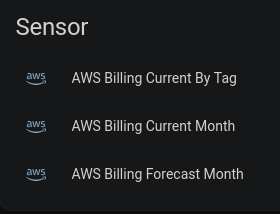
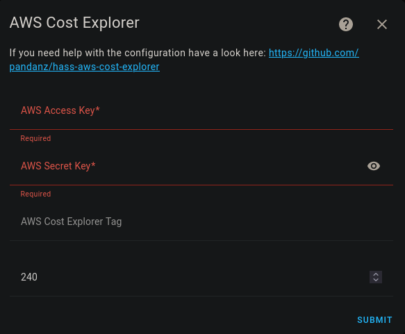

# AWS Cost Explorer
This is a custom component of Home Assistant.

[![GitHub Release][releases-shield]][releases]
[![GitHub Activity][commits-shield]][commits]
[![License][license-shield]](LICENSE)

![Project Maintenance][maintenance-shield]

Default Sensors:

## Features

This custom component allows you monitor your AWS account via Cost Explorer API for the current, forecasted and by tag.

**This integration will set up the following platforms.**

Platform | Description
-- | --
`sensor` | Show info from AWS Cost Explorer API.

## Installation

1. Open HACS Settings and add this repository (https://github.com/pandanz/hass-aws-cost-explorer/)
   as a Custom Repository (use **Integration** as the category).
2. The `hass-aws-cost-explorer` page should automatically load (or find it in the HACS Store)
3. Click `Install`

Alternatively, click on the button below to add the repository:

## Configuration is done in the UI

- id: '1711231232147237'
  alias: UpdateAWSSensors
  description: ''
  trigger:
  - platform: homeassistant
    event: start
  condition: []
  action:
  - service: homeassistant.update_entity
    metadata: {}
    data: {}
    target:
      entity_id:
      - sensor.aws_billing_current_by_tag
      - sensor.aws_billing_current_month
      - sensor.aws_billing_forecast_month
  mode: single

<!---->

***

[hass-aws-cost-explorer]: https://github.com/pandanz/hass-aws-cost-explorer
[commits-shield]: https://img.shields.io/github/commit-activity/y/pandanz/hass-aws-cost-explorer.svg?style=for-the-badge
[commits]: https://github.com/pandanz/hass-aws-cost-explorer/commits/main
[forum-shield]: https://img.shields.io/badge/community-forum-brightgreen.svg?style=for-the-badge
[forum]: https://community.home-assistant.io/
[license-shield]: https://img.shields.io/github/license/pandanz/hass-aws-cost-explorer.svg?style=for-the-badge
[maintenance-shield]: https://img.shields.io/badge/maintainer-pandanz-blue.svg?style=for-the-badge
[releases-shield]: https://img.shields.io/github/release/pandanz/hass-aws-cost-explorer.svg?style=for-the-badge
[releases]: https://github.com/pandanz/hass-aws-cost-explorer/releases
